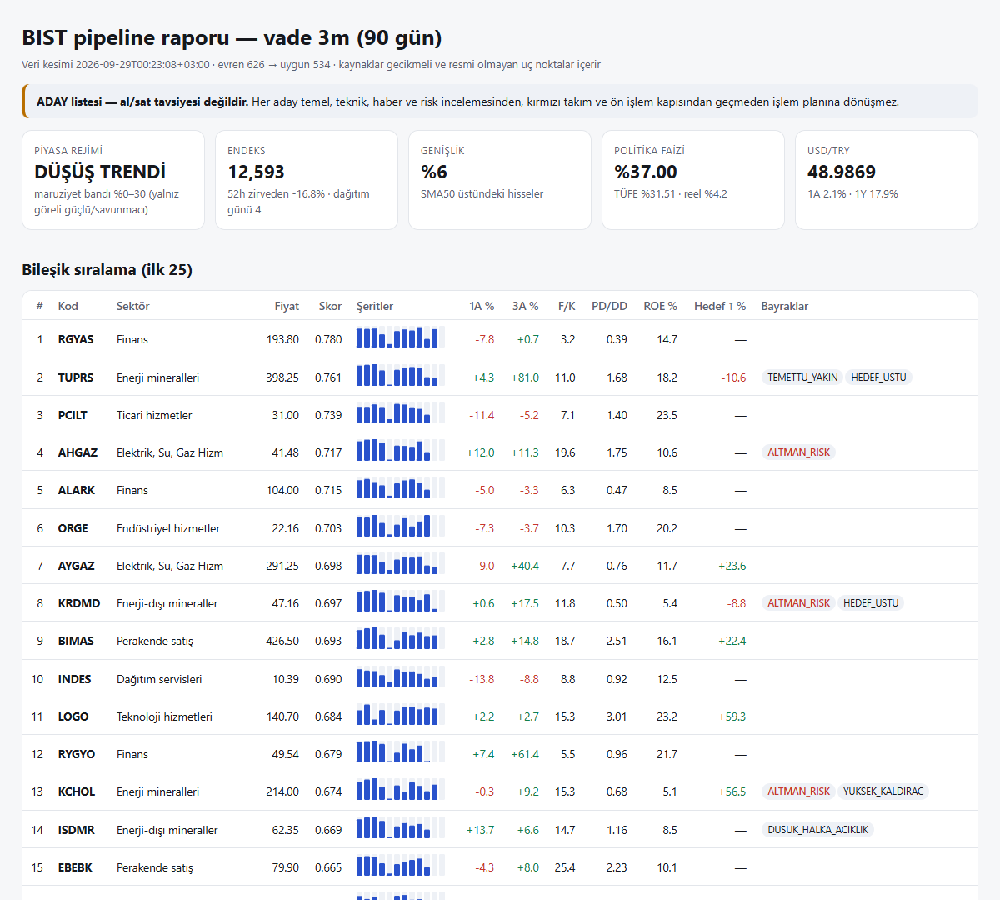

<p align="center">
  
</p>

<p align="center"><a href="README.md">Türkçe</a> · <a href="#download">Download</a> · <a href="#install">Install</a> · <a href="#use">Use</a> · <a href="CHANGELOG.md">Changelog</a> · <a href="DISCLAIMER.md">Disclaimer</a></p>

# Yiğit Investment Copilot

An Agent Skill for ChatGPT, Claude (claude.ai, Claude Code plugin), OpenCode and Codex that works like a disciplined equity research desk for **Borsa İstanbul (BIST)** — with TEFAS funds, US stocks (S&P 500), ETFs, crypto, warrants and VİOP context too.

It scans **every listed BIST stock** (or S&P 500 members), ranks candidates for a stated horizon across 12 lanes (momentum, short momentum, trend, setup, reversal, value, quality, growth, low risk, catalyst, **analyst expectations**, liquidity), builds evidence packs (KAP disclosures, quarterly statements, valuation models, technical state, historical base rates, probability ranges), checks the **market regime** with the live TCMB policy rate and CPI, runs an **investment committee** (seven portfolio-manager questions, claim labels, bear case first, investor lenses, risk committee), an independent **red team** and a **pre-trade gate**, and only then writes a **trade plan** and checks **portfolio fit**. Forecasts go into a hash-chained ledger with the thesis, kill condition, realized excess return and a lesson that the next analysis of the same name reads first.

> **Research and decision support only — not investment advice, no guaranteed returns, never places orders.**

<p align="center"><br><sub>Example output (29 Sep 2026, delayed data). A candidate list, not a recommendation.</sub></p>

## Download

| Platform | Package | Where |
|---|---|---|
| ChatGPT (web/mobile/desktop) | [yigit-investment-copilot-chatgpt.zip](https://github.com/yigityildiz0/yigit-investment-copilot/releases/latest/download/yigit-investment-copilot-chatgpt.zip) | Skills → Create → Upload |
| claude.ai | [yigit-investment-copilot-claude.zip](https://github.com/yigityildiz0/yigit-investment-copilot/releases/latest/download/yigit-investment-copilot-claude.zip) | Customize → Skills → Upload |
| Claude Code (plugin, recommended) | `claude plugin marketplace add yigityildiz0/yigit-investment-copilot` then `claude plugin install borsa@yigit-investment-copilot` | auto-updating; commands `/borsa:tara` … |
| Claude Code (manual) | [yigit-investment-copilot-claude-code.zip](https://github.com/yigityildiz0/yigit-investment-copilot/releases/latest/download/yigit-investment-copilot-claude-code.zip) | `~/.claude/skills/` + `~/.claude/commands/` |
| OpenCode | [yigit-investment-copilot-opencode.zip](https://github.com/yigityildiz0/yigit-investment-copilot/releases/latest/download/yigit-investment-copilot-opencode.zip) | `~/.config/opencode/` (skill + agent + commands) |
| Codex CLI / ChatGPT desktop | same as the ChatGPT package | `~/.agents/skills/` (invoke with `$yigit-investment-copilot`) |
| All in one | [yigit-investment-copilot-all-in-one.zip](https://github.com/yigityildiz0/yigit-investment-copilot/releases/latest/download/yigit-investment-copilot-all-in-one.zip) | every package + installers + docs |

Checksums: [SHA256SUMS.txt](https://github.com/yigityildiz0/yigit-investment-copilot/releases/latest/download/SHA256SUMS.txt)

## Install

- **ChatGPT:** upload the ChatGPT ZIP in Skills. The ChatGPT sandbox usually has no internet, so the skill browses primary sources or maps a screener CSV you upload (`map_export.py`) and runs the scan offline.
- **claude.ai:** enable Code execution, then Customize → Skills → Upload the Claude ZIP.
- **Claude Code:** add the marketplace and install the `borsa` plugin (above), or run `install/install.ps1 -Claude` / `bash install/install.sh --claude` for the skill plus unprefixed commands. Do not combine both.
- **Codex / OpenCode:** `install/install.ps1 -Codex -OpenCodeExtras` (Windows) or `bash install/install.sh --codex --opencode-extras`. OpenCode also reads `~/.claude/skills` and `~/.agents/skills`, so add only the agent and commands when the skill is already installed there.

Scripts need **Python 3.9+** and use only the standard library.

## Use

Ask naturally ("Find the BIST stocks with the best 3-month setup", "Should I buy THYAO for one month?", "What does the price imply?", "Write this morning's note", "Compare these money-market funds", "How should I split 150k TL across these four stocks by risk?", "Does momentum work on BIST? Test it."). On hosts with internet you can also run:

```bash
python scripts/borsa.py pipeline --horizon 3m          # whole BIST → REPORT.md + REPORT.html
python scripts/borsa.py pipeline --market america      # S&P 500 members
python scripts/borsa.py ticker THYAO --horizon 1m
python scripts/borsa.py brief --watchlist watch.csv    # morning-note data
python scripts/borsa.py sector --name Finans
python scripts/borsa.py fon screen --category hisse    # TEFAS funds: screen | fund CODE | compare A B C
python scripts/borsa.py taban --horizon 3m             # historical base rates of setups
python scripts/borsa.py izle --watchlist watch.csv     # positions vs their written plans
python scripts/borsa.py portfoy --candidates THYAO ASELS BIMAS --budget 150000
```

## Data

TradingView screener endpoint (unofficial, delayed; screening only, BIST and US), Yahoo Finance (unofficial; corporate actions repaired with the BIST ±10% limit rule), KAP public JSON (primary content), İş Yatırım statements (secondary), TCMB FX, policy rate and CPI (official), TEFAS JSON API (official operator data). Optional connectors: borsa-mcp, OpenBB MCP. Every number is reported with its source and time.

## Design principles

Evidence before opinion · point-in-time honesty · probabilities, not promises · process over picks · risk first · decision support only. Twelve golden prompts (`skill/.../evals/golden-prompts.json`) define what a correct answer must and must not do; `python tests/run_tests.py` runs 11 offline regression tests.

## License

[MIT](LICENSE) · by [Yiğit Yıldız](https://github.com/yigityildiz0) · see [DISCLAIMER.md](DISCLAIMER.md).
