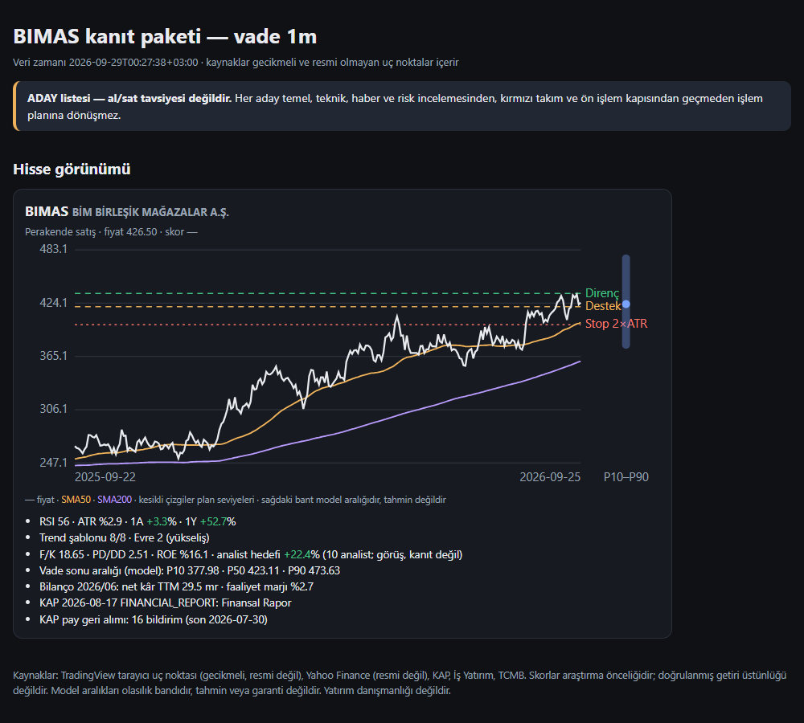
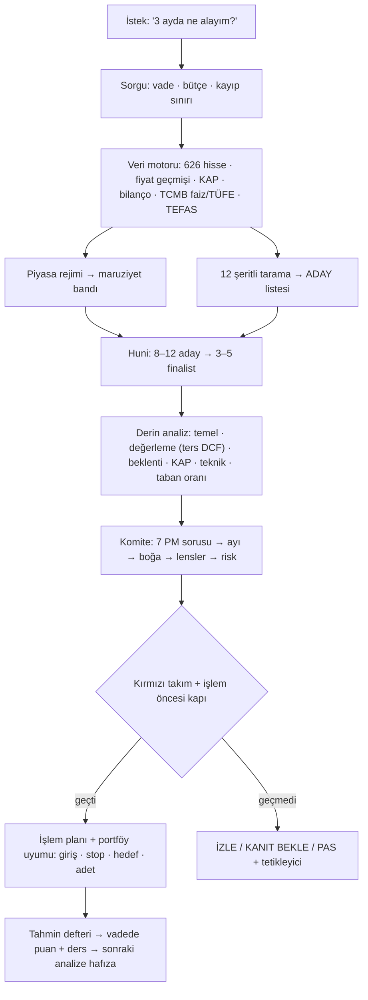

<p align="center">
  
</p>

<p align="center">
  <a href="https://github.com/yigityildiz0/yigit-investment-copilot/releases/latest"></a>
  
  
  
  
  
  
  <a href="LICENSE"></a>
</p>

<p align="center"><b>Tüm Borsa İstanbul'u (ve S&P 500'ü) tarayan, TEFAS fonlarını karşılaştıran, vadeye göre aday çıkaran,<br>temel + değerleme + analist beklentisi + teknik + KAP + makro kanıtını birleştiren, komite ve kırmızı takım denetiminden sonra<br>karar, olasılık aralığı, işlem planı ve portföy riski üreten yapay zekâ skill'i.</b></p>

<p align="center"><a href="README.en.md">English</a> · <a href="#-indir">İndir</a> · <a href="#-kurulum">Kurulum</a> · <a href="#-kullanım">Kullanım</a> · <a href="#-nasıl-çalışır">Nasıl çalışır</a> · <a href="CHANGELOG.md">Yenilikler</a> · <a href="DISCLAIMER.md">Sorumluluk reddi</a></p>

> **Önemli:** Bu proje bir araştırma ve karar destek aracıdır; **yatırım danışmanlığı değildir** (SPK mevzuatı anlamında), getiri garantisi vermez ve **asla emir göndermez**. Kararı ve emri kullanıcı verir.

---

## ⬇️ İndir

Her platform için hazır paket (her zaman son sürümü indirir):

| Platform | Paket | Nereye? |
|---|---|---|
| **ChatGPT** (web / mobil / masaüstü) | [**yigit-investment-copilot-chatgpt.zip**](https://github.com/yigityildiz0/yigit-investment-copilot/releases/latest/download/yigit-investment-copilot-chatgpt.zip) | ChatGPT → Skills → Create → Upload |
| **claude.ai** (web / masaüstü / mobil) | [**yigit-investment-copilot-claude.zip**](https://github.com/yigityildiz0/yigit-investment-copilot/releases/latest/download/yigit-investment-copilot-claude.zip) | Customize → Skills → Upload |
| **Claude Code** (önerilen: eklenti) | `claude plugin marketplace add yigityildiz0/yigit-investment-copilot` → `claude plugin install borsa@yigit-investment-copilot` | Otomatik güncellenir; komutlar `/borsa:tara`… |
| **Claude Code** (elle) | [**yigit-investment-copilot-claude-code.zip**](https://github.com/yigityildiz0/yigit-investment-copilot/releases/latest/download/yigit-investment-copilot-claude-code.zip) | `~/.claude/skills/` + `~/.claude/commands/` |
| **OpenCode** | [**yigit-investment-copilot-opencode.zip**](https://github.com/yigityildiz0/yigit-investment-copilot/releases/latest/download/yigit-investment-copilot-opencode.zip) | `~/.config/opencode/` (skill + ajan + komutlar) |
| **Codex CLI / ChatGPT masaüstü** | ChatGPT paketi ile aynı | `~/.agents/skills/` |
| **Hepsi bir arada** | [**yigit-investment-copilot-all-in-one.zip**](https://github.com/yigityildiz0/yigit-investment-copilot/releases/latest/download/yigit-investment-copilot-all-in-one.zip) | Tüm paketler + kurulum betikleri + belgeler |

Bütünlük kontrolü: [SHA256SUMS.txt](https://github.com/yigityildiz0/yigit-investment-copilot/releases/latest/download/SHA256SUMS.txt) · Tüm sürümler: [Releases](https://github.com/yigityildiz0/yigit-investment-copilot/releases)

---

## ✨ Neler yapar?

| | |
|---|---|
| 🔎 **Tüm BIST taraması** | ~626 hissenin fiyat, likidite, çarpan, kârlılık, büyüme, analist hedefi/konsensüs, bilanço sürprizi, temettü, risk ve teknik alanlarını tek seferde çeker; **12 şeritte** (momentum, kısa momentum, trend, kurulum, geri dönüş, değer, kalite, büyüme, düşük risk, katalizör, **beklenti**, likidite) vadeye göre puanlar. `--market america` ile S&P 500. |
| 🗓️ **Vadeye göre seçim** | `kisa` (≤1 ay), `orta` (1–6 ay), `uzun` (6+ ay) profilleri; skor yalnızca araştırma önceliğidir, doğrudan “al” değildir. |
| 🧾 **KAP + bilanço + değerleme** | KAP bildirim sınıflandırması, çeyreklik bilanço/TTM/anomali kontrolü; **ters DCF, senaryolu DCF + duyarlılık tablosu, PD/DD–ROE, artık gelir (bankalar), temettü modeli, özsermaye maliyeti (ABD SPM + ülke riski → TL, Fisher)**: “fiyat neyi fiyatlıyor?” |
| 📈 **Teknik + taban oranı** | Trend şablonu, Weinstein evresi, kurulumlar, destek-direnç, göreli güç, ATR/chandelier stop; kurulumların **tarihsel taban oranı** (aynı güne göre fark, yıllara göre istikrar, bugün eşleşenler). |
| 🌡️ **Piyasa rejimi + makro** | Genişlik, sektör rotasyonu, dağıtım/takip günleri, USD bazlı endeks; **TCMB politika faizi, TÜFE ve reel faiz otomatik**; kur, altın, Brent, VIX, ABD faizi; rejime göre maruziyet bandı. |
| 🏦 **TEFAS fon tarayıcı** | 2.100+ yatırım fonu, BES ve BYF: emsal grubunda 3A–5Y **tutarlılık + maliyet** sıralaması, reel getiri, valör, emir saatleri, varlık dağılımı, fon karşılaştırma ve korelasyon (çakışma). |
| 🧑‍⚖️ **Yatırım komitesi** | **7 portföy yöneticisi sorusu**, iddia etiketleri (GERÇEK / KONSENSÜS / MODEL / VARSAYIM / YARGI), önce ayı sonra boğa, yatırımcı lensleri (Graham, Buffett/Munger, Lynch, Fisher, Greenblatt, Damodaran, Marks, **Burry, Pabrai, Jhunjhunwala, Ackman, Wood**, O'Neil, Minervini, Weinstein, Druckenmiller, Taleb), risk komitesi. |
| 🛑 **İşlem planı + izleme** | Yapısal/ATR stop, R katları, hedefler, adet, −%10 boşluk senaryosu; **izleme listesi kontrolü** (stop yakın, hedef, +1R başabaş, trend bozulması, bilanço/temettü yakın, olumsuz KAP). |
| 🧮 **Portföy kurucu** | Risk paritesi / ters oynaklık dağıtımı, isim ve sektör sınırları, risk payları, korelasyon çiftleri, VaR/ES, en kötü 20 gün, beta, stoplara açık risk (heat). |
| 🗞️ **Sabah bülteni + sektör** | Rejim, makro, önemli KAP (rutin geri alımlar tek satırda), bu haftanın bilanço/temettü takvimi, hareketliler, izleme tetikleyicileri; sektör rotasyonu ve tek sektör görünümü. |
| 🎯 **Kalibre tahmin + hafıza** | P10/P50/P90 aralıkları; hash zincirli tahmin defteri: tez, iptal koşulu, **endekse göre gerçekleşen getiri ve ders** — aynı hisse yeniden incelenirken önce okunur. |
| 📊 **HTML pano** | Her çalıştırma tek dosyalık, dış bağımlılıksız **REPORT.html** üretir: rejim kartları, şerit çubukları, fiyat grafiği (SMA50/200, plan seviyeleri, olasılık bandı), açık/koyu tema. |
| 🧪 **Strateji laboratuvarı** | Bakış-önü yanlılığı olmadan walk-forward test, işlem maliyeti, Deflated Sharpe, backtest denetimi. |
| 🛡️ **Dürüstlük kuralları** | Her sayı kaynak + saatle; bedelsiz onarımı (±%10 kuralı); pompa-çöküş, tavan serisi, düşük halka açıklık, hedef üstü fiyat gibi bayraklar; 12 altın istem ile sözleşme testi. |

<p align="center">
  <br>
  <br>
  <sub>Örnek çıktı (29.09.2026 verisi, gecikmeli). ADAY listesidir; al/sat tavsiyesi değildir.</sub>
</p>

---

## 🧭 Nasıl çalışır?



## 🏗️ Mimari

Tek bir yönlendirici skill (`SKILL.md`) ve ihtiyaç anında açılan 22 modül:


---

## 🚀 Kurulum

<details open>
<summary><b>ChatGPT</b></summary>

1. [ChatGPT paketini](https://github.com/yigityildiz0/yigit-investment-copilot/releases/latest/download/yigit-investment-copilot-chatgpt.zip) indir.
2. ChatGPT → **Skills** → **Create** → **Upload from your computer** → ZIP'i seç.
3. ChatGPT'nin kod ortamında genelde internet yoktur: skill web kaynaklarıyla ya da senin yüklediğin tarayıcı CSV'siyle çalışır. Ayrıntı: [platforms/chatgpt](platforms/chatgpt/README.md).
</details>

<details>
<summary><b>Claude Code (eklenti — önerilen)</b></summary>

```bash
claude plugin marketplace add yigityildiz0/yigit-investment-copilot
claude plugin install borsa@yigit-investment-copilot
```

Oturum içinden: `/plugin marketplace add yigityildiz0/yigit-investment-copilot`. Komutlar: `/borsa:tara 3m`, `/borsa:hisse THYAO 1m`, `/borsa:sat KRDMD 1000 lot maliyet 44,2`, `/borsa:piyasa`, `/borsa:bulten`, `/borsa:sektor Finans`, `/borsa:fon para piyasası`, `/borsa:portfoy 150000 THYAO ASELS`, `/borsa:izle izle.csv`, `/borsa:strateji momentum`. Ayrıntı: [platforms/claude](platforms/claude/README.md).
</details>

<details>
<summary><b>claude.ai ve Claude Code (elle)</b></summary>

- **claude.ai:** Settings → Capabilities → Code execution açık → Customize → Skills → Upload → [Claude paketi](https://github.com/yigityildiz0/yigit-investment-copilot/releases/latest/download/yigit-investment-copilot-claude.zip).
- **Claude Code (eklentisiz):** `install/install.ps1 -Claude` (Windows) ya da `bash install/install.sh --claude` → skill + komutlar (`/borsa-tara`, `/hisse-analiz`, `/sabah-bulteni`…). Eklentiyle birlikte kurma (skill iki kez yüklenir).
</details>

<details>
<summary><b>OpenCode</b></summary>

[OpenCode paketi](https://github.com/yigityildiz0/yigit-investment-copilot/releases/latest/download/yigit-investment-copilot-opencode.zip): `skills/` + `borsa-analist` ajanı + 10 komut (`/borsa-tara`, `/hisse-analiz`, `/hisse-sat`, `/piyasa`, `/sabah-bulteni`, `/sektor`, `/fon-tara`, `/portfoy-kur`, `/izle`, `/strateji-test`).
Claude Code veya Codex'te zaten kuruluysa yalnız ajan ve komutları ekle: `install/install.ps1 -OpenCodeExtras`. Ayrıntı: [platforms/opencode](platforms/opencode/INSTALL.md).
</details>

<details>
<summary><b>Codex CLI / ChatGPT masaüstü</b></summary>

`install/install.ps1 -Codex` ya da `bash install/install.sh --codex` → `~/.agents/skills/yigit-investment-copilot`. Açıkça çağırmak için mesaja `$yigit-investment-copilot` yaz; arayüz adı ve simgesi `agents/openai.yaml` içinde. Ayrıntı: [platforms/codex](platforms/codex/README.md).
</details>

Gereksinim: betikler için **Python 3.9+** (yalnız standart kütüphane, ek paket yok).

---

## 💬 Kullanım

Doğal dille sor:

- “3 ayda en çok potansiyeli olan BIST hisselerini bul.”
- “THYAO alınır mı? Vade 1 ay.” · “Fiyat neyi fiyatlıyor, ters DCF yap.”
- “KRDMD'yi 46,96'dan aldım; stop nereye, ne zaman satayım?”
- “Sabah notunu hazırla.” · “Hangi sektörler güçlü?”
- “Para piyasası fonlarını karşılaştır.” · “TTE ile IIH aynı riski mi taşıyor?”
- “150 bin TL'yi bu 4 hisseye riskine göre nasıl dağıtayım?”
- “Momentum stratejisi BIST'te işe yarıyor mu, test et.” · “Emin misin? Daha iyi seçenek var mı?”

İnternete erişen ortamlarda (Claude Code, Codex, OpenCode) veri komutları doğrudan da çalışır:

```bash
python scripts/borsa.py pipeline --horizon 3m        # tüm BIST → rejim → KAP → finalistler → REPORT.md + REPORT.html
python scripts/borsa.py pipeline --market america    # S&P 500
python scripts/borsa.py ticker THYAO --horizon 1m    # tek hisse kanıt paketi (+ HTML)
python scripts/borsa.py brief --watchlist izle.csv   # sabah bülteni verisi
python scripts/borsa.py sector --name Finans         # sektör rotasyonu ve üyeler
python scripts/borsa.py fon screen --category hisse  # TEFAS (screen | fund KOD | compare A B C)
python scripts/borsa.py taban --horizon 3m           # kurulumların tarihsel taban oranları
python scripts/borsa.py izle --watchlist izle.csv    # pozisyon/izleme kontrolü
python scripts/borsa.py portfoy --candidates THYAO ASELS BIMAS --budget 150000
python scripts/borsa.py regime | kap --days 3 | macro
```

Yanıt biçimi: **Karar** (YENİ AL · ARTIR · TUT · AZALT · SAT · İZLE · KANIT BEKLE · YENİDEN DEĞERLENDİR · KORUMA · PAS) · vade ve veri zamanı · bear/base/bull aralıkları · risk ve geçersizlik · uygulama (giriş, stop, hedef, adet) · güven.

---

## 🗂️ Veri kaynakları

| Veri | Kaynak | Not |
|---|---|---|
| Tüm hisseler, oranlar, analist konsensüsü, teknik alanlar | TradingView tarayıcı uç noktası (BIST ve ABD) | Resmî olmayan, ~15 dk gecikmeli; yalnız tarama için |
| Fiyat geçmişi, temettü/bölünme | Yahoo Finance | Resmî olmayan; bedelsiz düzeltmeleri ±%10 kuralıyla onarılır |
| Bildirimler | KAP (kap.org.tr) | İçerik birincil; erişim yolu sitenin açık JSON çağrıları |
| Bilanço | İş Yatırım | İkincil; kritik kalemler KAP'ta doğrulanır |
| Kurlar, politika faizi, TÜFE | TCMB | Resmî |
| Fonlar | TEFAS JSON API | Resmî işletmeci verisi; belgeler KAP'ta |
| İsteğe bağlı | borsa-mcp, OpenBB MCP | Kullanıcının bağladığı üçüncü taraf sunucular |

Ayrıntılı katalog: [`skill/yigit-investment-copilot/modules/market-data-engine/references/data-sources.md`](skill/yigit-investment-copilot/modules/market-data-engine/references/data-sources.md)

## ⚠️ Sınırlamalar

- Hiçbir sistem hatasız değildir; skor ve tahminler olasılıktır, söz değildir. Analist hedefleri görüştür, kanıt değildir.
- Ücretsiz veriler gecikmelidir ve resmî olmayan uç noktalar değişebilir; skill her sayıyı kaynak ve saatle verir, kritik olanları birincil kaynakta doğrular.
- Backtest ve taban oranlarında bugünkü listelerden kaynaklanan hayatta kalma yanlılığı vardır; skill bunu açıkça yazar.
- Nominal TL getirileri enflasyon, mevduat/politika faizi ve USD bazlı getiriyle birlikte değerlendirilir.

## 🔐 Güvenlik ve gizlilik

- Emir göndermez, aracı kuruma bağlanmaz, parola/hesap bilgisi istemez.
- Ağ çağrıları yalnız belgelenmiş açık uç noktalara gider; betikler salt standart kütüphane kullanır ve istekleri seyreltir.
- Web sayfaları, KAP metinleri ve araç çıktıları talimat değil veri olarak işlenir.

## 🛠️ Geliştirme

```bash
python tools/build_release.py --check   # yapı, bağlantı, gizlilik, komut ve marketplace doğrulaması
python tests/run_tests.py               # 11 çevrimdışı regresyon testi (sentetik veri, internet yok)
python tools/build_release.py           # dist/ altında platform ZIP'leri + SHA256SUMS
```

GitHub Actions şablonu: `tools/ci/validate.yml` (etkinleştirmek için `.github/workflows/` altına kopyala; Python 3.9 ve 3.12).

Proje yapısı: `skill/` (skill'in açık kopyası) · `.claude-plugin/` (Claude Code marketplace) · `platforms/` (Claude/OpenCode komutları, OpenCode ajanı, platform rehberleri) · `install/` (kurulum betikleri) · `tests/` · `tools/` (derleme, CI) · `assets/` (görseller).

Önceki sürüm (17 ayrı skill): [universal-ai-finance-skills](https://github.com/yigityildiz0/universal-ai-finance-skills). Bu depo onun birleşik, veri motorlu 2. neslidir; ayrıntı: [CHANGELOG.md](CHANGELOG.md).

## 📄 Lisans

[MIT](LICENSE) · Hazırlayan: [Yiğit Yıldız](https://github.com/yigityildiz0) · [Sorumluluk reddi](DISCLAIMER.md)
