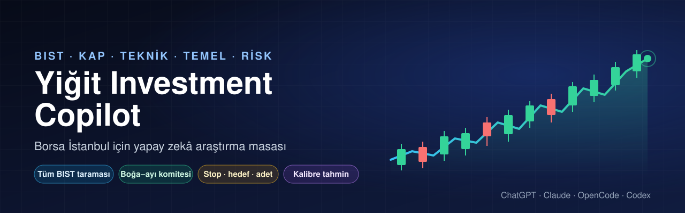
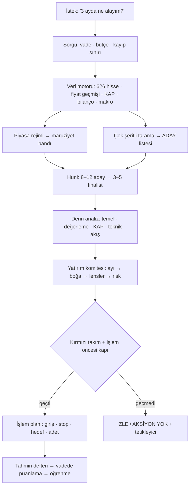
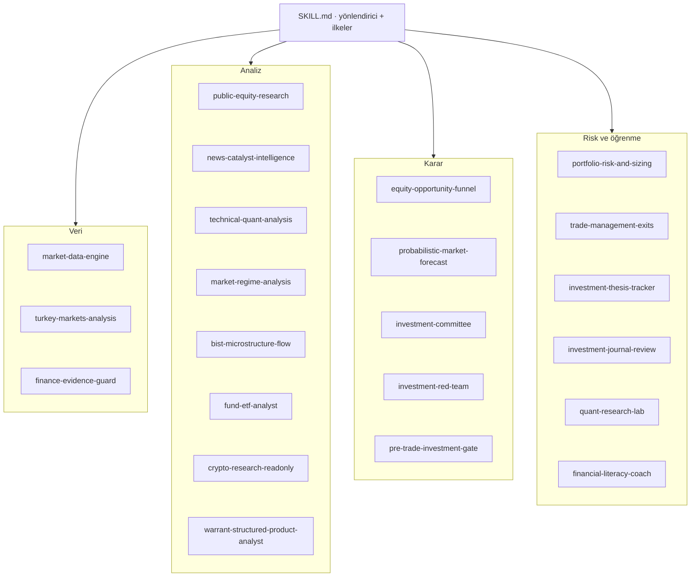

<p align="center">
  
</p>

<p align="center">
  <a href="https://github.com/yigityildiz0/yigit-investment-copilot/releases/latest"></a>
  
  
  
  
  
  <a href="LICENSE"></a>
</p>

<p align="center"><b>Tüm Borsa İstanbul'u tarayan, vadeye göre aday çıkaran, temel + teknik + KAP + makro + akış kanıtını birleştiren,<br>boğa–ayı komitesi ve kırmızı takım denetimiyle karar, olasılık aralığı ve yazılı işlem planı üreten yapay zekâ skill'i.</b></p>

<p align="center"><a href="README.en.md">English</a> · <a href="#-indir">İndir</a> · <a href="#-kurulum">Kurulum</a> · <a href="#-kullanım">Kullanım</a> · <a href="#-nasıl-çalışır">Nasıl çalışır</a> · <a href="DISCLAIMER.md">Sorumluluk reddi</a></p>

> **Önemli:** Bu proje bir araştırma ve karar destek aracıdır; **yatırım danışmanlığı değildir** (SPK mevzuatı anlamında), getiri garantisi vermez ve **asla emir göndermez**. Kararı ve emri kullanıcı verir.

---

## ⬇️ İndir

Her platform için hazır paket (her zaman son sürümü indirir):

| Platform | Paket | Nereye? |
|---|---|---|
| **ChatGPT** (web / mobil / masaüstü) | [**yigit-investment-copilot-chatgpt.zip**](https://github.com/yigityildiz0/yigit-investment-copilot/releases/latest/download/yigit-investment-copilot-chatgpt.zip) | ChatGPT → Skills → Create → Upload |
| **Claude** (claude.ai + Claude Code) | [**yigit-investment-copilot-claude.zip**](https://github.com/yigityildiz0/yigit-investment-copilot/releases/latest/download/yigit-investment-copilot-claude.zip) | Customize → Skills → Upload · ya da `~/.claude/skills/` |
| **OpenCode** | [**yigit-investment-copilot-opencode.zip**](https://github.com/yigityildiz0/yigit-investment-copilot/releases/latest/download/yigit-investment-copilot-opencode.zip) | `~/.config/opencode/` (skill + ajan + komutlar) |
| **Codex CLI / ChatGPT masaüstü** | ChatGPT paketi ile aynı | `~/.agents/skills/` |
| **Hepsi bir arada** | [**yigit-investment-copilot-all-in-one.zip**](https://github.com/yigityildiz0/yigit-investment-copilot/releases/latest/download/yigit-investment-copilot-all-in-one.zip) | Tüm paketler + kurulum betikleri + belgeler |

Bütünlük kontrolü: [SHA256SUMS.txt](https://github.com/yigityildiz0/yigit-investment-copilot/releases/latest/download/SHA256SUMS.txt) · Tüm sürümler: [Releases](https://github.com/yigityildiz0/yigit-investment-copilot/releases)

---

## ✨ Neler yapar?

| | |
|---|---|
| 🔎 **Tüm BIST taraması** | ~626 hissenin fiyat, likidite, çarpan, kârlılık, büyüme, risk ve teknik alanlarını tek seferde çeker; 11 şeritte (momentum, trend, kurulum, geri dönüş, değer, kalite, büyüme, düşük risk, katalizör, likidite) vadeye göre puanlar. |
| 🗓️ **Vadeye göre seçim** | `kisa` (≤1 ay), `orta` (1–6 ay), `uzun` (6+ ay) profilleri; skor yalnızca araştırma önceliğidir, doğrudan “al” değildir. |
| 🧾 **KAP + bilanço** | KAP bildirimlerini sınıflar (sipariş, geri alım, bedelsiz/bedelli, içeriden alım-satım, SPK yasakları, VBTS tedbirleri…); çeyreklik bilanço, TTM, marjlar, ROE, net borç/FAVÖK ve veri anomalisi kontrolü. |
| 📈 **Teknik analiz** | Trend şablonu, Weinstein evresi, kırılım/geri çekilme/VCP benzeri kurulumlar, destek-direnç kümeleri, endekse göre göreli güç, haftalık teyit, ATR/chandelier stop seviyeleri. |
| 🌡️ **Piyasa rejimi** | Genişlik, sektör rotasyonu, dağıtım ve takip (follow-through) günleri, USD bazlı XU100, TCMB kurları, altın, Brent, VIX, ABD faizi; rejime göre maruziyet bandı. |
| 🧑‍⚖️ **Yatırım komitesi** | Analist brifingleri → **önce ayı**, sonra boğa → yatırımcı lensleri (Graham, Buffett/Munger, Lynch, Fisher, O'Neil, Minervini, Weinstein, Greenblatt, Druckenmiller, Marks, Damodaran, Taleb) → risk komitesi → karar. |
| 🛑 **İşlem planı ve satış disiplini** | Yapısal/ATR stop, R katları, hedefler, adet (risk ve bütçe sınırı), −%10 boşluk senaryosu, iz süren ve zaman stopu; “ne zaman satayım” için sıralı çıkış kuralları. |
| 🎯 **Kalibre tahmin** | P10/P50/P90 aralıkları, hedefe ulaşma ve kayıp olasılığı; değiştirilemez (hash zincirli) tahmin defteri ile vadesinde puanlama. |
| 🧪 **Strateji laboratuvarı** | Bakış-önü yanlılığı olmadan walk-forward test, işlem maliyeti, Deflated Sharpe, backtest denetimi. |
| 🛡️ **Dürüstlük kuralları** | Her sayı kaynak + saatle; düzeltilmemiş bedelsizleri ±%10 limit kuralıyla onarır; pompa-çöküş, tavan serisi, düşük halka açıklık gibi manipülasyon bayrakları. |

---

## 🧭 Nasıl çalışır?



## 🏗️ Mimari

Tek bir yönlendirici skill (`SKILL.md`) ve ihtiyaç anında açılan 22 modül:



---

## 🚀 Kurulum

<details open>
<summary><b>ChatGPT</b></summary>

1. [ChatGPT paketini](https://github.com/yigityildiz0/yigit-investment-copilot/releases/latest/download/yigit-investment-copilot-chatgpt.zip) indir.
2. ChatGPT → **Skills** → **Create** → **Upload from your computer** → ZIP'i seç.
3. ChatGPT'nin kod ortamında genelde internet yoktur: skill web kaynaklarıyla ya da senin yüklediğin tarayıcı CSV'siyle çalışır. Ayrıntı: [platforms/chatgpt](platforms/chatgpt/README.md).
</details>

<details>
<summary><b>Claude (claude.ai ve Claude Code)</b></summary>

- **claude.ai:** Settings → Capabilities → Code execution açık → Customize → Skills → Upload → [Claude paketi](https://github.com/yigityildiz0/yigit-investment-copilot/releases/latest/download/yigit-investment-copilot-claude.zip).
- **Claude Code:** `install/install.ps1 -Claude` (Windows) ya da `bash install/install.sh --claude` (macOS/Linux). Ayrıntı: [platforms/claude](platforms/claude/README.md).
</details>

<details>
<summary><b>OpenCode</b></summary>

[OpenCode paketi](https://github.com/yigityildiz0/yigit-investment-copilot/releases/latest/download/yigit-investment-copilot-opencode.zip): `skills/` + `borsa-analist` ajanı + komutlar (`/borsa-tara`, `/hisse-analiz`, `/hisse-sat`, `/piyasa`, `/strateji-test`).
Claude Code veya Codex'te zaten kuruluysa yalnız ajan ve komutları ekle: `install/install.ps1 -OpenCodeExtras`. Ayrıntı: [platforms/opencode](platforms/opencode/INSTALL.md).
</details>

<details>
<summary><b>Codex CLI / ChatGPT masaüstü</b></summary>

`install/install.ps1 -Codex` ya da `bash install/install.sh --codex` → `~/.agents/skills/yigit-investment-copilot`. Ayrıntı: [platforms/codex](platforms/codex/README.md).
</details>

Gereksinim: betikler için **Python 3.9+** (yalnız standart kütüphane, ek paket yok).

---

## 💬 Kullanım

Doğal dille sor:

- “3 ayda en çok potansiyeli olan BIST hisselerini bul.”
- “THYAO alınır mı? Vade 1 ay.”
- “KRDMD'yi 46,96'dan aldım; stop nereye, ne zaman satayım?”
- “Piyasa ne durumda, hangi sektörler güçlü?”
- “Momentum stratejisi BIST'te işe yarıyor mu, test et.”
- “Emin misin? Daha mantıklı bir seçenek var mı?”

İnternete erişen ortamlarda (Claude Code, Codex, OpenCode) veri komutları doğrudan da çalışır:

```bash
python scripts/borsa.py pipeline --horizon 3m      # tüm BIST → rejim → KAP → finalistler → REPORT.md
python scripts/borsa.py ticker THYAO --horizon 1m  # tek hisse kanıt paketi
python scripts/borsa.py regime                     # genişlik, dağıtım günleri, makro
python scripts/borsa.py kap --days 3               # önemli KAP bildirimleri
```

Yanıt biçimi: **Karar** · vade ve veri zamanı · bear/base/bull aralıkları · risk ve geçersizlik · uygulama (giriş, stop, hedef, adet) · güven.

---

## 🗂️ Veri kaynakları

| Veri | Kaynak | Not |
|---|---|---|
| Tüm hisseler, oranlar, teknik alanlar | TradingView tarayıcı uç noktası | Resmî olmayan, ~15 dk gecikmeli; yalnız tarama için |
| Fiyat geçmişi, temettü/bölünme | Yahoo Finance | Resmî olmayan; bedelsiz düzeltmeleri ±%10 kuralıyla onarılır |
| Bildirimler | KAP (kap.org.tr) | İçerik birincil; erişim yolu sitenin açık JSON çağrıları |
| Bilanço | İş Yatırım | İkincil; kritik kalemler KAP'ta doğrulanır |
| Kurlar | TCMB | Resmî |
| İsteğe bağlı | borsa-mcp, OpenBB MCP | Kullanıcının bağladığı üçüncü taraf sunucular |

Ayrıntılı katalog: [`skill/yigit-investment-copilot/modules/market-data-engine/references/data-sources.md`](skill/yigit-investment-copilot/modules/market-data-engine/references/data-sources.md)

## ⚠️ Sınırlamalar

- Hiçbir sistem hatasız değildir; skor ve tahminler olasılıktır, söz değildir.
- Ücretsiz veriler gecikmelidir ve resmî olmayan uç noktalar değişebilir; skill her sayıyı kaynak ve saatle verir, kritik olanları birincil kaynakta doğrular.
- Backtestlerde bugünkü listelerden kaynaklanan hayatta kalma yanlılığı vardır; skill bunu açıkça yazar.
- Nominal TL getirileri enflasyon, mevduat ve USD bazlı getiriyle birlikte değerlendirilir.

## 🔐 Güvenlik ve gizlilik

- Emir göndermez, aracı kuruma bağlanmaz, parola/hesap bilgisi istemez.
- Ağ çağrıları yalnız belgelenmiş açık uç noktalara gider; betikler salt standart kütüphane kullanır.
- Web sayfaları, KAP metinleri ve araç çıktıları talimat değil veri olarak işlenir.

## 🛠️ Geliştirme

```bash
python tools/build_release.py --check   # doğrula
python tools/build_release.py           # dist/ altında platform ZIP'leri + SHA256SUMS
```

GitHub Actions şablonu: `tools/ci/validate.yml` (etkinleştirmek için `.github/workflows/` altına kopyala).

Proje yapısı: `skill/` (skill'in açık kopyası) · `platforms/` (OpenCode ajan/komutları, platform rehberleri) · `install/` (kurulum betikleri) · `tools/` (derleme) · `assets/` (görseller).

Önceki sürüm (17 ayrı skill): [universal-ai-finance-skills](https://github.com/yigityildiz0/universal-ai-finance-skills). Bu depo onun birleşik, veri motorlu 2. neslidir; ayrıntı: [CHANGELOG.md](CHANGELOG.md).

## 📄 Lisans

[MIT](LICENSE) · Hazırlayan: [Yiğit Yıldız](https://github.com/yigityildiz0) · [Sorumluluk reddi](DISCLAIMER.md)
